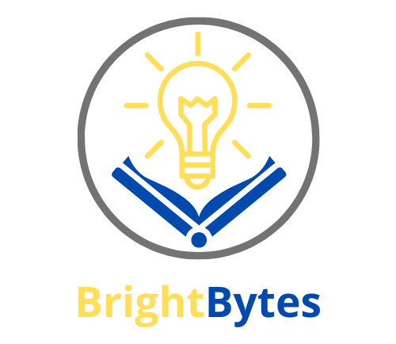

<h1 align="center">Bright Bytes</h1>
<br>
<p align="center">

<br>
 
## 📋 Table of contents
  - [Our Idea](#idea)
  - [Documentation and Presentation](#docs)
  - [Team](#collaborators)
  - [Technologies](#technologies)
  - [Installation](#instal)
 
## 💡 Our Idea <a name="idea"></a>
Our objective is to develop an educational app focused on education with tests and quizez.
#### 
## 📄 Documentation and Presentation <a name="docs"></a>
[Documentation](https://codingburgas-my.sharepoint.com/:w:/g/personal/psdineva21_codingburgas_bg/EVOiqgAH1j1InbB-oXVJI6IBTukTSROr3uBvIP0gSpIszQ?rtime=k9EXVAhf3Eg)
<br>
[Presentation](https://codingburgas-my.sharepoint.com/:p:/g/personal/psdineva21_codingburgas_bg/EX3MQUDkHadFsfiNVUUIU4UBoOi-7pUfNfYwn6dbQ0KjDg?e=YNMMKM)
 
## 🌱 Team <a name="collaborators"></a>
> 1. **Scrum trainer**	- **VBKanev22** 
   - ***GitHub profile***: [***VBKanev22***](https://github.com/VBKanev22)	
> 2. **Back-end**- **MANikolov22**	
   - ***GitHub profile***: [***MANikolov22***](https://github.com/MANikolov22)	
> 3. **Back-end Developer** - **NNLibchev22** 	
   - ***GitHub profile***: [***NNLibchev22***](https://github.com/NNlibchev22)
> 4. **Back-end Developer** - **TSMadjarov21**	
   - ***GitHub profile***: [***TSMadjarov22***](https://github.com/tsmadjarov21)
> 5. **Back-end Developer** - **KDIvanov21**	
   - ***GitHub profile***: [***KDIvanov21***](https://github.com/KDIvanov21)
> 6. **Back-end Developer** - **SSNikolov21**	
   - ***GitHub profile***: [***SSNikolov21***](https://github.com/SSNikolov21)
> 7. **Quality Assurance** - **PSDineva21**	
   - ***GitHub profile***: [***PSDineva21***](https://github.com/PSDineva21)
<br>

## ⚒️Tools  <a name="technologies"></a>
<p align="left"> 


</p> 
<br>

## 💻 Languages
<p align="left"> 

</p>

## ⚙️ Installation	<a name = "installation"></a>
````	
1. cmd 
2. git clone https://github.com/codingburgas/school-project-assignment-brightbytes
````
 
 
## 👏 Appreciation
```
Thank you for scrolling this far! Please consider giving the repo a star ⭐.
```

